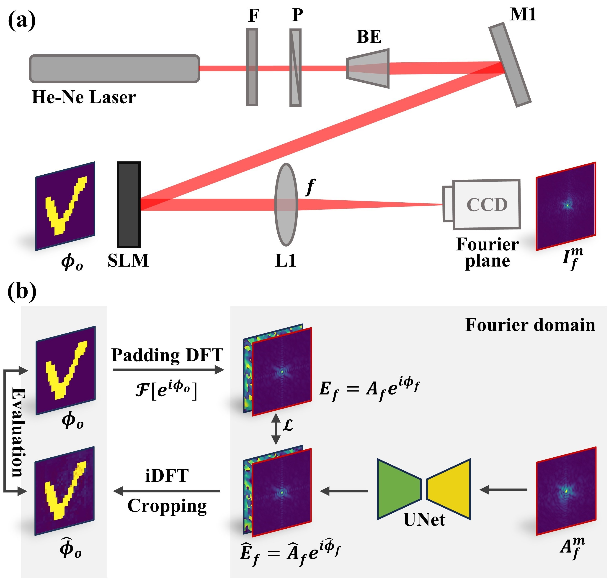

[//]: # (This directory provides definitions for a few common models, dataloaders, scheduler,)

[//]: # (and optimizers that are often used in training.)

[//]: # (The definition of these objects are provided in the form of lazy instantiation:)

[//]: # (their arguments can be edited by users before constructing the objects.)

[//]: # (They can be imported, or loaded by `model_zoo.get_config` API in users' own configs.)


# Generating Mean Transition Time (MTT) Images from Label-Free Optical Imaging Using MA-DenseUNet

## Overview
This repository implements an interpretable Fourier-domain deep learning framework for phase retrieval. The method reconstructs complex-valued wavefronts from intensity-only measurements while preserving physical Object-Fourier domain relationships.



### Key Contributions
1. **Fourier-Domain Learning** – First deep learning framework that directly operates in the frequency domain while preserving physical Object-Fourier relationships.
2. **State-of-the-Art Performance** – Achieves 8 dB higher wPSNR and 0.982 PC on benchmarks.
3. **Robust Generalization** – Maintains high accuracy (PC > 0.9) on unseen patterns, overcoming overfitting in data-driven approaches.
4. **Interpretable Reconstructions** – Provides traceable phase recovery aligned with optical principles.

For detailed information, please refer to our paper: [xxx].

## Repository Structure
In this repository, we have customized the required model, dataloaders, scheduler, optimizer, loss, and evaluation according to Detectron2's training requirements.

- `configs/`: Contains corresponding configuration files associated with the recipes.
- `data/`: Contains the script for data loading and transforms.
- `modeling/`: Contains the implementation of the UNet model and related scripts model training.
- `evaluation/`: Contains the script for evaluation model.
- `common/`: Contains scripts for optimizer and scheduler.
- `scr/`: Contains example of data, json file, checkpointers and figures. 

## Getting Started

### Prerequisites

This repository leverages Meta's [Detectron2](https://github.com/facebookresearch/detectron2) as the training framework. To use this, you need to install our modified branch of Detectron2:
```bash
git clone -b sy/for_generative_MTT https://github.com/MPAPS2019/detectron2.git
cd detectron2
python setup.py install
```
Other required packages include:
- Python 3.9
- PyTorch
- Other dependencies as listed in `requirements.txt`

### Installation

Clone this repository:

```bash
git clone https://github.com/MPAPS2019/FourierPhaseRetrieval.git
cd FourierPhaseRetrieval
```

### Training UNet model
1. **Prepare the Data**
   - Organize dataset-related information into a JSON file for both training dataset and test dataset. See instructions for [data preparation](data/README.md).

2. **Configure Training Parameters**
   - Set the training parameters in the configuration file, see [example](configs/baseline_basicunet_FourierAmp2SLMFFTField_IFFT.py). Adjust hyperparameters, model settings, and other configuration options as needed.

3. **Start Training**
   - Here presents the training recipes:
     - [`lazyconfig_train_net.py`](recipes/lazyconfig_train_net.py): using `AMPTrainer` with all training data.
   -  The terminal command is as follows:

     ```bash
     python lazyconfig_train_net.py --config-file <path-to-config-file>
     ```
     
4. **Continue your Training**
   - If your training us interrupted, you can resume training using the following command:
   
     ```bash
     python lazyconfig_train_net.py --config-file <path-to-config-file> --resume
     ```
     The training will continue from your last saved checkpointer.


### Evaluating model
   - You can evaluate the model after training by specifying the saved checkpoint file. You can set global value `INIT_CHECKPOINT` as your checkpointer path in configuration file, then run the command
   
     ```bash
     python lazyconfig_train_net.py --config-file <path-to-config-file> --eval-only 
     ```
     
     or using the command directly:
   
     ```bash
     python lazyconfig_train_net.py --config-file <path-to-config-file> --eval-only train.checkpoint=<path-to-checkpoint-file>
     ```
     
   - You can also evaluate the model during training:
     - When using `lazyconfig_train_net.py` to train all data, you can customize the frequency of evaluations during training by setting the `EVAL_EPOCH`.
   

## Data Availability
Preprocessed data are provided in the [`src/data`](src/data), including EMNIST datset and Fashion-MNIST dataset used in our paper.

## Citation
If you find this work useful, please cite our paper:

```bibtex
@article{your_paper_reference,
  title={Your Paper Title},
  author={Your Name and Others},
  journal={Journal Name},
  year={2024},
  volume={XX},
  number={X},
  pages={XX-XX},
  doi={10.XXXX/XXXXXX}
}
```
